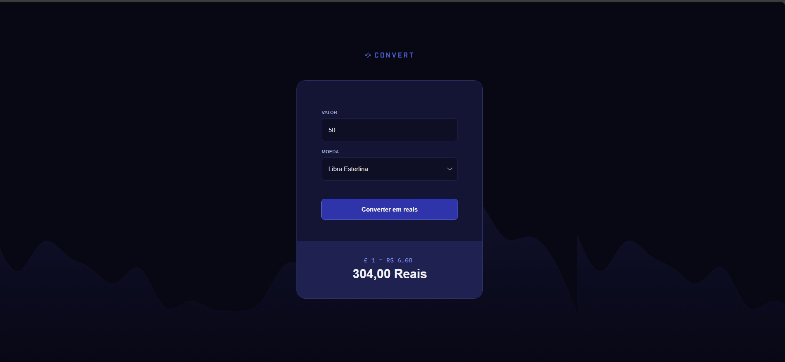

# Convert

## 🚀 Sobre o Projeto

Convert é uma aplicação que permite converter valores entre diferentes unidades de medida. O projeto foi desenvolvido durante os estudos na Rocketseat.

## 🎯 Funcionalidades

- Conversão entre diferentes moedas
- Interface intuitiva e responsiva

## 🛠️ Tecnologias Utilizadas

- HTML5
- CSS3
- JavaScript
